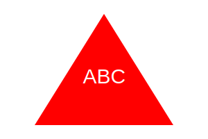

# ImageCreator

An application to create a small svg(image) based off user input.

## Links

https://drive.google.com/file/d/1Cq3ooYPeA-YJONkz2FGWXOZNcIBRfB73/view

https://github.com/JPhanvilay/ImageCreator

Below is an image created through the application. Can also be found in the repository in the images folder.

